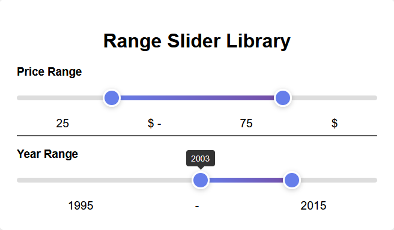

# Vanilla JS Range Slider



A simple, lightweight, and fast dual-thumb range slider created with vanilla JavaScript. It has no external dependencies, is fully responsive, and allows users to select a range of values between a minimum and maximum.

This component was created for developers who need a straightforward, customizable range slider without the overhead of libraries like jQuery or other large frameworks. Its focus is on performance, ease of use, and simplicity.

## Features

- **Zero Dependencies:** Written entirely in vanilla JavaScript.
- **Dual Thumbs:** Allows for the selection of a value range.
- **Customizable:** Easily set the min, max, step, and initial values.
- **Responsive:** Works smoothly on different screen sizes.
- **Callback Function:** Provides an `onChange` event to react to value changes.
- **Dynamic Tooltips:** Clearly displays the current value of each thumb.

## Installation

Download the minified files from the `dist` folder and include them in your HTML. The build process is automated via GitHub Actions, and you can download the latest build artifacts from the "Actions" tab of the repository.

```html
<link rel="stylesheet" href="dist/rangeSlider.min.css">
<script src="dist/rangeSlider.min.js"></script>
```

## Usage

1.  Create a `div` element in your HTML to serve as the container.
    ```html
    <div id="my-slider"></div>
    ```

2.  Initialize the `RangeSlider` in your JavaScript.
    ```javascript
    const mySlider = new RangeSlider('#my-slider', {
        min: 0,
        max: 100,
        step: 1,
        values: [20, 80]
    });
    ```

## Options

Customize the slider by passing an options object during initialization.

| Option     | Type             | Default      | Description                                          |
|------------|------------------|--------------|------------------------------------------------------|
| `min`      | `Number`         | `0`          | The minimum value of the range slider.               |
| `max`      | `Number`         | `100`        | The maximum value of the range slider.               |
| `step`     | `Number`         | `1`          | The increment/decrement step value.                  |
| `values`   | `Array<Number>`  | `[25, 75]`   | The initial values for the two slider thumbs.        |
| `onChange` | `Function`       | `null`       | A callback function that is triggered when a thumb is released after its value has changed. It receives the low and high values as arguments. |

## Methods

Methods can be called on your `RangeSlider` instance.

### `.onChange(callback)`

Sets or updates the `onChange` callback function after the slider has been initialized.

-   `callback` (Function): The function to execute when a value changes. It receives `low` and `high` values as arguments.

**Example:**
```javascript
const mySlider = new RangeSlider('#my-slider');

mySlider.onChange((low, high) => {
    console.log(`The new range is ${low} - ${high}`);
});
```

## Example

Here's a complete, practical example.

```html
<!DOCTYPE html>
<html lang="en">
<head>
    <meta charset="UTF-8">
    <meta name="viewport" content="width=device-width, initial-scale=1.0">
    <title>Range Slider Example</title>
    <!-- For development, you can use the source files -->
    <link rel="stylesheet" href="src/rangeSlider.css">
</head>
<body>

    <h3>Price Range</h3>
    <div id="price-slider"></div>
    <p>Selected range: <span id="price-values"></span></p>

    <!-- For development, you can use the source files -->
    <script src="src/rangeSlider.js"></script>
    <script>
        const priceValues = document.getElementById('price-values');

        const priceSlider = new RangeSlider('#price-slider', {
            min: 0,
            max: 500,
            step: 10,
            values: [50, 250],
            onChange: (low, high) => {
                priceValues.textContent = `$${low} - $${high}`;
            }
        });

        // Set initial text content on page load
        priceValues.textContent = `$${priceSlider.low} - $${priceSlider.high}`;
    </script>

</body>
</html>
```